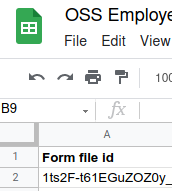

# Employer Statement Generator
This tool generates personalized employer statements, for employees who have to work during curfew hours in the Netherlands. The tool generates personalized statements, based on the employee's personalia and working hours. This tool consists of two components, that can be used independently of each other:
- A web-frontend in which statements can be generated based on manual input
- An automated script that generates statements based on a Google Sheet

The script enables communication to the employee in the following ways, all of which are optional:
- Email
- Slack
- Manually communicating the URL or printing the document

The tool runs in Google Script. It uses a Google Slides document as an engine for generating PDF files. Google Spreadsheets are used for logging and configuration purposes.

## Example
We have an example environment running to showcase the webapp. It can be found <a href="https://script.google.com/a/macros/teampicnic.com/s/AKfycbz2KTuYNWlja0ycvv3WMKgcFStJVDahuo3b3ZES4dc7YmLivL_cACJxnA/exec">here</a>.


<br>To avoid abuse of the example tool, right now access settings prevent anyone but the creator to generate actual statements. An example statement can be found <a href="https://drive.google.com/file/d/1qDpJmuYAsASbJedzspMp0qjlTyLWESOS/view">here</a>.

## Installation
This section describes the steps to install the script on your own environment. Please start at "General setup", and then head over to "Setup webapp" or "Setup Automated Script" based on which environment you'd like to configure (first).

### General setup
To make it easier to install this script and its dependencies, we created "ready to copy" versions of each of the required resources. Alternatively, the files in this repo can be moved over to your (company) Google Drive manually.

#### Create the Google Script
First, start by creating a copy of the script. Go to <a href="https://script.google.com/u/3/home/projects/10o-8UMfeHqyZF40bv4zYALgERa2rdQT7a94uFIREm9wWjBJ_u95dCjzZ">this link</a> and press the copy icon:


#### Create the configuration sheet
<br>We also have to copy the configuration sheet that can be <a href="https://docs.google.com/spreadsheets/d/1Ut0LqYJrMlk3FXyiP2scaEvey6vI9srxf49BrUleH2Q/edit#gid=0">found here</a>:


<br>Now, we have to link to configuration sheet to the script. To do that, we have to replace a small piece of code in the script. Don't worry, this is the only time we have to touch the actual code.

Navigate to the code editor in the script, then open the file `Code.gs` if it isn't opened already (it should open by default):


<br>On line 1, there is a piece of code that contains the following:
```
var configId = "1saiF5RRjg3tLyEioRghMQDZHoJKNNbTh3nZqvZ--w4A";
```
Replace the ID of the example configation sheet `1saiF5RRjg3tLyEioRghMQDZHoJKNNbTh3nZqvZ--w4A` with the ID of the configuration file you've just copied (it is part of the URL: docs.google.com/spreadsheets/d/<b>1Ut0LqYJrMlk3FXyiP2scaEvey6vI9srxf49BrUleH2Q</b>/edit#gid=0).

#### Create the employer statement template
Finally, we have to create a copy of the employer statement template we prepared, that can be found <a href="https://docs.google.com/presentation/d/1ts2F-t61EGuZOZ0y_PMwhM8fDQvISQTfjl-OYutEizc/edit#slide=id.gb7abb18c9d_0_0">here</a>:


<br>Copy the ID of the document over to the configuration sheet under the field <b>Form file id</b> (column A, cell 2):



<br>In this employer's statement template, please <b>fill in all fields that are not personalized per employee</b> (like company address, company name, etc).

### Set up webapp
To set up the webapp, we first have to configure the logs, then we must deploy the application itself.

#### Create webapp logs
When setting up the webapp to generate forms, we need to create a file that will contain the logs. These logs can be used to track who generates forms using the webapp, for the sake of accountability.

Make a copy of the template file <a href="https://docs.google.com/spreadsheets/d/18dorJnDTF3NhxHHXl62ivKAqqqDW8vDHAdkrx_lCCIc/edit#gid=0">here</a> (the same way as we've copied the configuration file). Then, copy the ID of the newly copied file, and put it in the configuration sheet under the field <b>Log manual</b> (column B, cell 3).

#### Deploy webapp
Head back to the script file (the copied version you created during the general setup). In the top-right corner there should be a blue deploy button. Click it, then choose the "New deployment" option.


<br>A popover will show up, allowing you to configure the webapp:
- The <b>description</b> doesn't matter, feel free to keep it empty.
- For <b>Execute as</b>, make sure it's set to <b>Me</b> (your Google account).
- For <b>Who has access</b>, choose an appropriate setting. Generally, we recommend limiting access to either your organization or only yourself. Further access restrictions can be configured, see the next section.


<br>When you are finished configuring, click the blue "Deploy" button. Next, follow the steps on the screen to authorize the tool access to the relevant parts of your Google account. Finally, you will get a URL at which the webapp is located. The webapp is now ready to be used.

#### Configure access settings
In the configuration sheet, the final column (column P) is named "Access to manual tool". Under this label, you can put down a list of email addresses that are allowed to generate employer statements. You can also choose to keep it empty, in which case any email address will be allowed to generate statements (this is of course subject to the access configuration that you chose in the previous section).

### Set up automated script
To set up the automated script, we need a log sheet, a data source, and we need to choose how to run the automated script.

#### Creating the log sheet
When setting up the automated script, we need to create a file that will contain the logs. These logs can be used to track which forms were generated and sent successfully, but also to track potential failures.

Make a copy of the template file <a href="https://docs.google.com/spreadsheets/d/1pyinueOmyW8b2ARggFP_xB_N8jjUfVtdHN6Op--eagM/edit#gid=0">here</a> (the same way as we've copied the configuration file). Then, copy the ID of the newly copied file, and put it in the configuration sheet under the field <b>Log automated</b> (column C, cell 3).

#### Creating the data source
This section describes how to create a sheet that contains the employee data for which employer statements should be sent. Again, we have a template file that can be used, but the script can also be configured to read employee data in a different format. The template can be found <a href="https://docs.google.com/spreadsheets/d/1KNFLI8YkJh3opZxCBdz4DvY6k0ajCUqOodOGb6GrRZQ/edit#gid=0">here</a>. You can copy this template and fill it with your own employee data. Then, you must reference the ID of this file in the configuration sheet in the cell below the <b>Data file</b> label (column D, cell 3). If you choose to go with this input data template, you can move on to the next section. If you want to customize it, the rest of this section has more information on the controls that are available for that.

If you choose to use different headers than the ones configured in the template file, or you'd like for other fields to be configured in the document template as well, you have to modify column I and J of the configuration file:


<br>The data in the "Field" column should not be changed. It refers to the fields in the <a href="https://docs.google.com/presentation/d/1ts2F-t61EGuZOZ0y_PMwhM8fDQvISQTfjl-OYutEizc/edit#slide=id.gb7abb18c9d_0_0">employer statement document</a>. In that document, we gave each field a hidden "alt" value such the script can recognize them. However, the placeholder values in the "Cell" column can be changed to the appropriate cell names in your input data.

So, for instance, if your input data has a column named "Address" that holds the company address, you can set the cell next to `<<company_address>>` to `[Address]`. The script will replace the placeholder value `[Address]` by the value of the address cell for each employee in their personalized documents. The same thing already happens to the other cells, like `[Role]`.

The field `[Today]` is somewhat special, since it doesn't have to be specified in your input data, but will automatically be set to the current date. You can override it with a custom value though, if you create a column named "Today" in your input data.

You can also put plain text or multiple placeholder values in the "Cell" values. An example of this is `Van [Shift start] tot [Shift end]` that we use to denote the hours in which an employee is exempt from the curfew. This configuration replaces `[Shift start]` and `[Shift end]` by the corresponding shift start and shift end times sourced from the input data. Because `Van` and `tot` will not be replaced, it results in the following in the generated document:


<br> You don't have to use placeholder values in the cell contents. You can also hardcode something that must be filled in, like your company name. Although, rather than hardcoding it in the configuration, consider hardcoding it in the document template instead. Every field that is kept empty will not be replaced, thus safe precious performance.

<b>Note:</b> Make sure all date fields (like shift start, shift end, and birthdate) are formatted as such in your data sheet. So instead of a string value "today at 12 o'clock", the value needs to have a value in a date format that is recognized by Google Sheets, like "11-12-2020 15:00". If the fields are not formatted correctly, the script will fail.

#### Setting up communication
After generating the document, the URL per employee is registered in the log file. From there, it can be printed or copied elsewhere. However, it is also possible for the document to be sent automatically to the employee. To do that, a few things need to be configured.

First of all, we must write the message that the employee will receive. You can put the message you want to be sent to the employee in the cell below <b>Message</b> (column E, row 3) in the configuration file. In the message, you should use the placeholder value `[drive_url]`, which the script will replace by the URL of the generated report.

Next, we must configure either email or Slack communication (follow the corresponding steps below).

##### Email
Email can be configured by configuring the information in the `-- Email configuration --` section of the configuration sheet. In the cell below <b>Log recipient</b> (column F, row 8), put your own email. Every time the automated script runs, you will be sent a link to its logs. You can also keep it empty, if you do not wish to receive the logs of the script.

In the <b>Employee email</b> cell (column G, row 8) you can put a placeholder value of the email address of the employee. For instance, you can put the value `[Email]` in that cell, such that the script will use the email addresses from the "Email" column in your data sheet. The <b>Email subject</b> (column H, row 8) can be set to something like `Here's your employer statement`, which will be used as the subject of the email message that is sent to the employees.

As an example, consider the following communication configuration:


<br> It will send the following email to the employee:


##### Slack
Create a Slack app in your organization. Configure it to have both a <b>Webhook</b> and an <b>Authorization</b> token with the `chat.postMessage` permission. Then, put the info in the appropriate fields in the configuration sheet. For the Webhook, you can paste the entire URL of the webhook in the <b>Webhook</b> cell (column F, row 4). For the Authorization token, copy the token (in the form `xoxb-[unique ID here]`) into the cell below <b>Authorization</b> (column G, row 4).

The <b>Slack ID</b> field should contain a placeholder value of the Slack id of the employee. Put the value `[Slack ID]` in its cell (column H, row 4), and then create a "Slack ID" column in your datasheet and put the Slack IDs of the employees there.

#### Running the script
Finally, we've configured everything for the automated script, now it's time to either run it manually or set a <i>trigger</i> that runs it automatically. To send all employer reports for all employees that work today in the datasheet, we can run the `sendForms` function in the google script:


<br>If we want to run the script automatically every day, we can configure a trigger. Go to the "Triggers" tab of the Google Script, and press "Create new trigger" in the bottom left corner. You will get the following popover:


<br>Choose the `sendForms` function, choose a `Day timer` and set the time of day for the script to run corresponding to when you need the forms to be sent. Press "Save" in the bottom left corner to create the trigger. Of course, you need to make sure the data sheet is updated daily as well, before this script runs.

## Need help setting something up?
If you run into problems setting up this script, feel free to either start a discussion in GitHub or contact me at simon.baars@teampicnic.com. I'll be happy to help out. If you have any improvements for the script or the artifacts that come with it, feel free to open a PR with your changes. If you like what you see, consider starring the project.
